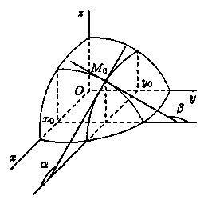

# Частные производные функции многих переменных

## Первого порядка

Пусть задана функция $z = f(x; y)$. Так как $x$ и $y$ - независимые переменные, то одна из них может изменяться, а другая нет.

Дадим переменной $x$ приращение $\Delta x$, а переменную $y$ оставим неизменной. Тогда $z$ получит приращение, которое называется частным приращением $z$ по $x$, которое обозначается $\Delta_x z$.

$$\Delta_x z = f(x + \Delta x; y) - f(x; y)$$

Аналогично получаем приращение по $y$ $\Delta_y z = (f; y + \Delta y) - f(x;y)$

Полное приращение $\Delta z = f(x + \Delta x; y + \Delta y) - f(x; y)$

Если существует предел
$$
\lim_{\Delta x \to 0} \frac{\Delta_x z}{\Delta x} = \lim_{\Delta x \to 0} \frac{f(x + \Delta x; y) - f(x; y)}{\Delta x}
$$
то он называется *частной производной* функции $z = f(x; y)$ в точке $M(x;y)$ по переменной $x$ и обозначается как:
$$
z_x', \; \frac{\partial z}{\partial x}, \;  f_x', \; \frac{\partial f}{\partial x}
$$

### Геометрический смысл

Графиком функции $z = f(x; y)$ является некоторая поверхность. График функциии $z = f(x; y_0)$ - линия пересечения этой поверхности с плоскостью $y = y_0$. Исходя из смысла производной ФОП, заключаем, что $f_x'(x_0; y_0) = \tan \alpha$, где $\alpha$ - угол между касательной и осью $Ox$.

## Частные производные высщих порядков

Частные производные $\frac{\partial f(x; y)}{\partial x}$ и $\frac{\partial f(x; y)}{\partial y}$ называют частными производными первого порядка, которые можно рассматривать как функции от $(x; y) \in D$. Эти функции могут иметь частные производные, которые называются *частными производными второго порядка*.

$$ \frac{\partial}{\partial x} \left( \frac{\partial z}{\partial x} \right) = \frac{\partial^2 z}{\partial x^2} = z_{xx}'' = f_{x^2}'' (x; y) $$

$$ \frac{\partial}{\partial x} \left( \frac{\partial z}{\partial y} \right) = \frac{\partial^2 z}{\partial y \partial x} = z_{xy}'' = f_{xy}'' (x; y) $$

$$ \frac{\partial}{\partial y} \left( \frac{\partial z}{\partial x} \right) = \frac{\partial^2 z}{\partial x \partial y} = z_{yx}'' = f_{yx}'' (x; y) $$

$$ \frac{\partial}{\partial y} \left( \frac{\partial z}{\partial y} \right) = \frac{\partial^2 z}{\partial y^2} = z_{yy}'' = f_{y^2}'' (x; y) $$

Частные производные высших порядков по различным переменным называются **смешанными частными производными**.

> *Th.* Если частные производные высшего порядка непрерывны, то смешанные производные одного порядка, отличающиеся по порядком дифференцирования равны между собой.